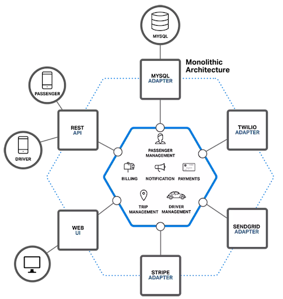
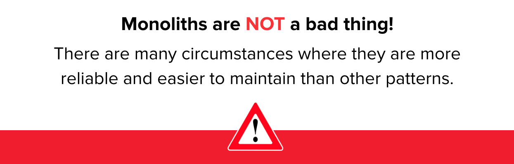
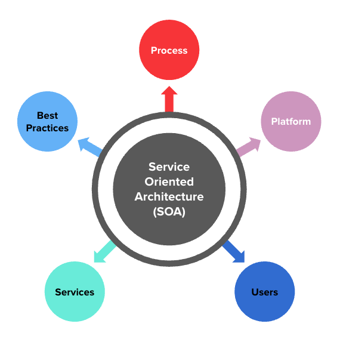
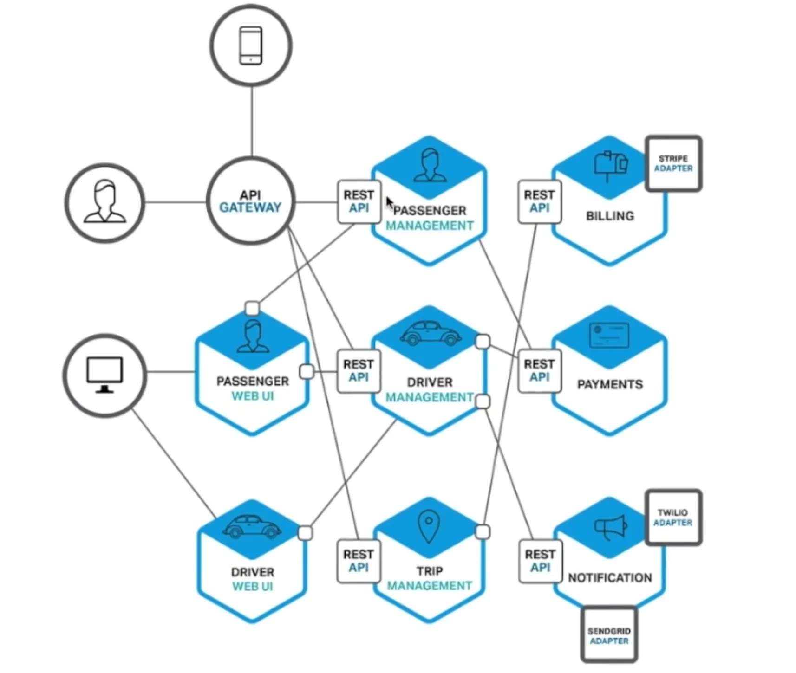

<h1>
  Intro to Cloud Infrastructure
  Cloud Architecture Models
</h1>

**Learning objective:** By the end of this lesson, students will be able to explain the key characteristics, advantages, and disadvantages of monolithic, service-oriented, and microservices architecture models.

When we talk about cloud architecture models we are likely talking about one of three structures.

## The Monolith Architecture

A **monolithic architecture** is a software design where all components of an application are built as a single, unified system. Everything, like the user interface, database, and business logic, is tightly integrated and runs as one piece of software. This makes it easier to develop and manage initially but can become harder to scale or modify as the system grows.

Consider this early model of **Uber's** infrastructure:

[Source](https://medium.com/@anselmleo/clear-the-clutter-what-a-microservice-architecture-is-not-53f9cc163eff)

 

| **The Good**                                                    | **The Bad**                                                           |
| --------------------------------------------------------------- | --------------------------------------------------------------------- |
| Single Codebase: Easier to manage everything in one place.      | Single Point of Failure: If one part breaks, everything goes down.    |
| Easy Data Sharing: Components can share information easily.     | Hard to Scale: Tough to scale individual parts of the system.         |
| Centralized Control: Simple to manage all the data in one spot. | Risky Changes: A change in one area can affect the whole system.      |
| Simple Deployment: You deploy everything at once.               | Deployment Risk: If deployment fails, the whole system might go down. |
| Easy Testing: Testing the whole system is more straightforward. | Reliability Issues: As the app grows, reliability can suffer.         |
| Good Performance: Works well for smaller apps.                  | Slower Development: Growth can slow down development speed.           |

 

 

A monolithic architecture can work better for some businesses, especially smaller or early-stage ones, because it’s simple and easy to manage. With everything tightly connected, development, testing, and deployment are more straightforward.

This setup allows for faster development, lower costs, and easier communication between parts of the system.

## The Service-Oriented Architecture

**Service-Oriented Architecture (SOA)** is a way of building software where different parts, called services, work independently but communicate with each other over a network. Each service does one specific job, and they can be changed or updated without disrupting the whole system. This makes it easier to adapt and scale.

An SOA is often considered a **_transitional design_** between a classic monolith and full microservices because it incorporates elements of both approaches while providing a path for businesses to gradually shift from tightly coupled systems to more modular, scalable ones.

Some key features are:

- Actions are broken out into discrete services.

- A common database may be used and one deployment may house multiple services.

 

| **The Good**                                                       | **The Bad**                                                        |
| ------------------------------------------------------------------ | ------------------------------------------------------------------ |
| Simpler Codebase: Easier to manage.                                | Service Complexity: Services can still be complicated.             |
| Clear Separation: Display and logic are kept separate.             | Cross-Dependencies: Shared data can create links between services. |
| Easier to Upgrade: Makes it simpler to replace parts later.        | Can Become Like a Monolith: Over time, it can resemble a monolith. |
| Better Data Sharing: Easier to share information between services. |                                                                    |
| Central Data Control: Keeps data management centralized.           |                                                                    |
| Good Performance: Can be efficient in some cases.                  |                                                                    |

## The Microservice Architecture

**Microservices architecture** is a design approach where a software application is built as a collection of small, independent services. Each service focuses on a specific function or feature and can be developed, deployed, and scaled separately.

Microservices architecture and Service-Oriented Architecture share similarities but differ in key ways:

- Each service is independently deployable.
- Each service has its own logic and database with a narrow goal.
- Microservices are intended to manage a more granular single concern or function.

Take a look at Uber's updated infrastructure reconfigured as microservices:

 

[Source](https://medium.com/@anselmleo/clear-the-clutter-what-a-microservice-architecture-is-not-53f9cc163eff)

 

| **The Good**                                                                    | **The Bad**                                                         |
| ------------------------------------------------------------------------------- | ------------------------------------------------------------------- |
| Easier to Understand: Complexity is visible.                                    | Slow Data Queries: Cross-service data queries take longer.          |
| Independent Updates: Services can be updated separately.                        | Complex Setup: Development environments are harder to manage.       |
| Better Team Scaling: Easier for teams to work in parallel.                      | Harder Debugging: Finding issues is more difficult across services. |
| Scalable: Can grow easily with demand.                                          | Ownership Issues: Defining responsibilities is more complicated.    |
| Easier Testing: Services can be tested separately.                              | Higher Costs: More expensive infrastructure.                        |
| Flexible Languages: Different services can use different programming languages. |                                                                     |

## Which one should we use?

When it comes to choosing between monolithic, service-oriented, and microservices architectures, each has its strengths depending on a company's needs.

Businesses should evaluate factors like team size, project complexity, scalability needs, and long-term goals to choose the model that best fits their growth stage and technical requirements.

  <h2 class="title">Extra Reading: From Monolith to Microservices</h2>
  

Whether or not to move to a microservices architecture is a question that many companies face as they scale.

Here are some extra case studies to discover some of the decisions and challenges from a companies that have taken this leap.

|                                                             Netflix                                                              |                                                Box                                                 |                                                      Kong                                                       |
| :------------------------------------------------------------------------------------------------------------------------------: | :------------------------------------------------------------------------------------------------: | :-------------------------------------------------------------------------------------------------------------: |
|                                                             |                                       |                                                  |
| [Adopting Microservices at Netflix](https://www.f5.com/company/blog/nginx/microservices-at-netflix-architectural-best-practices) | [Box Co-Founder on Moving From Monolith to Microservices](https://kubernetes.io/case-studies/box/) | [Breaking Up a Monolith at Kong](https://buttercms.com/books/microservices-for-startups/breaking-up-a-monolith) |
