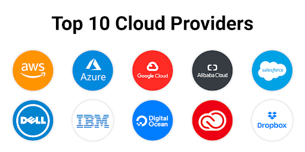
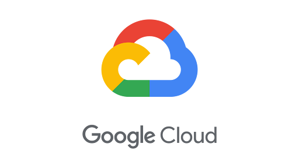

<h1>
  Intro to Cloud Infrastructure
  Comparing Cloud Providers
</h1>

**Learning objective:** By the end of this lesson, students will be able to compare and contrast the features and offerings of major cloud providers—specifically AWS, Microsoft Azure, and Google Cloud—identifying their key strengths, weaknesses, and use cases for different business needs.

## Cloud Providers

Everyone has heard of AWS, Google Cloud, and Microsoft Azure. But did you know that there are many other smaller cloud providers? It’s not uncommon for organizations to use multiple cloud providers.

 

 

## Let's Compare

On the surface, it seems that these cloud providers offer a very similar thing and the details of the hardware provided are either a very specialist concern or not overly important. However, when we look at the services they provide, there can be some key differences that set them apart.

 

| Brand                                                                                    | Provider                  | Overview                                                                                           |
| ---------------------------------------------------------------------------------------- | ------------------------- | -------------------------------------------------------------------------------------------------- |
|                    | Amazon Web Services (AWS) | Offers extensive services and flexibility, ideal for customization and scalability.                |
|                | Microsoft Azure           | Integrates well with Microsoft tools and offers strong enterprise solutions.                       |
|  | Google Cloud              | Focuses on AI, machine learning, and data analytics, offering simplicity with powerful data tools. |

 

Let’s take a closer look at the differences between three of the top providers; **Amazon Web Services**, **Microsoft Azure** and **Google Cloud**.

 

## Computing Power

| AWS                                                                                                       | Azure                                                                                     | Google Cloud                                                                                                               |
| --------------------------------------------------------------------------------------------------------- | ----------------------------------------------------------------------------------------- | -------------------------------------------------------------------------------------------------------------------------- |
|                                     |                 |                                    |
| EC2 offers customizable VMs from pre-configured or custom machine images, with flexible resource scaling. | Azure VMs use Virtual Hard Disks (VHDs), with seamless integration into Azure's ecosystem | Google Compute Engine provides flexible VM creation, with pre-configured options and adjustable size, memory, and storage. |

### The approach to computing power, provisioning, and usage

The main challenge in computing is _scalability_.

- **AWS** EC2 allows for on-demand scalability with customizable VMs and machine images, offering a high level of flexibility.

- **Azure** uses Virtual Hard Disks (VHDs) with virtual machine scale sets for scalability and load balancing, providing seamless integration with its cloud tools but offering fewer customization options than AWS.

- **Google Cloud** provides Compute Engine with flexible VM configurations, auto-scaling, load balancing, and AI-driven optimization tools for enhanced performance.

 

## Storage

| AWS                                                                                   | Azure                                                                           | Google Cloud                                                                             |
| ------------------------------------------------------------------------------------- | ------------------------------------------------------------------------------- | ---------------------------------------------------------------------------------------- |
|                 |       |  |
| S3, Elastic Block Store (EBS), and Glacier storage with a **5 TB** object size limit. | Blob and Disk storage, along with a Standard Archive, with a **4.75 TB** limit. | Standard, Nearline, and Coldline storage options, with a **5 TB** object size limit.     |

### Cloud storage offerings

Cloud storage is essential for effective cloud deployment, and each provider offers distinct solutions.

- **AWS** features S3 for scalable storage, **Elastic Block Store (EBS)** for persistent block storage, and Glacier for archiving.

- **Azure** provides **Blob** and **Disk** storage, alongside a Standard Archive for different data needs.

- **Google Cloud** Storage includes multi-class options like **Standard**, **Nearline**, and **Coldline**, catering to diverse storage requirements.

While all three platforms support unlimited objects, AWS and Google Cloud have a **5 TB** limit on object size, whereas Azure has a slightly lower limit of **4.75 TB**.

 

## Developer Experience

| AWS                                                                                                                     | Azure                                                                                                                                          | Google Cloud                                                                                                                   |
| ----------------------------------------------------------------------------------------------------------------------- | ---------------------------------------------------------------------------------------------------------------------------------------------- | ------------------------------------------------------------------------------------------------------------------------------ |
|                                                   |                                                                      |                                        |
| Extensive documentation and a user-friendly dashboard with integrated tutorials, though user management can be complex. | Less intuitive interface, making it more challenging for developers without prior experience. Centralized user management can simplify access. | User-friendly interface with clear documentation, tutorials, and tools like Cloud Shell for quick and interactive development. |

### Documentation and simplicity of use

- **AWS**: Known for its extensive documentation and integrated tutorials, AWS offers a comprehensive dashboard but can present complexity in user management.

- **Azure**: Although Azure offers centralized user account management, its documentation and interface may be less intuitive for developers without prior experience.

- **Google Cloud**: Prioritizes simplicity with a user-friendly interface and integrated tutorials, making documentation and service management easy to access.

 

## Machine Learning Modelling

| AWS                                                                                               | Azure                                                                                                                                          | Google Cloud                                                                                                                          |
| ------------------------------------------------------------------------------------------------- | ---------------------------------------------------------------------------------------------------------------------------------------------- | ------------------------------------------------------------------------------------------------------------------------------------- |
|                             |                                                                      |                                               |
| Users need programming and data science skills to utilize AWS Machine Learning tools effectively. | Azure's Machine Learning tools require no programming or data science experience, featuring a drag-and-drop interface for easy model creation. | Google Cloud AI Platform supports both coding and codeless workflows, with pre-built models and AutoML for users with less expertise. |

### Machine learning (ML) modeling

AWS, Azure, and Google Cloud each have unique approaches to machine learning (ML) modeling.

- **AWS** offers **SageMaker**, which is ideal for experienced developers with coding and data science skills, providing flexibility, but requiring a bit of technical expertise.

- **Azure** features **Azure ML Studio**, a user-friendly drag-and-drop interface that allows users to build ML models without programming knowledge, making it great for data analysts and other non-coders.

- **Google Cloud** combines both worlds with its **AI Platform** for advanced users and **AutoML** for those with less technical experience, allowing for easy model training with minimal setup.

Overall, AWS caters to developers, Azure simplifies ML for non-coders, and Google Cloud provides options for multiple skill sets.

 

## How to choose?

Cloud providers offer similar services, but each has unique features tailored to specific use cases. Understanding these differences and ensuring that a provider meets all your application needs can be difficult due to the vast array of services and functionalities available.

As a result, many businesses hire consultants and third-party agencies to assist in planning their cloud infrastructure.
