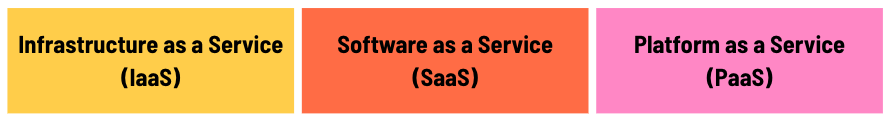
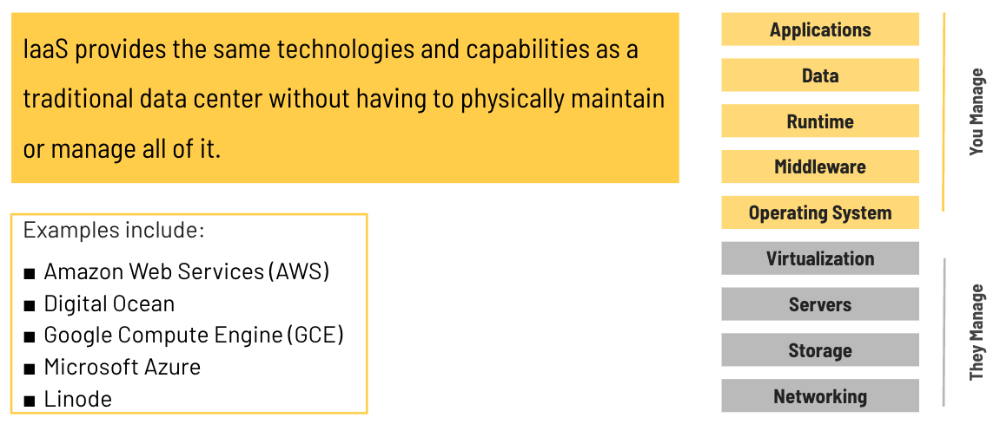
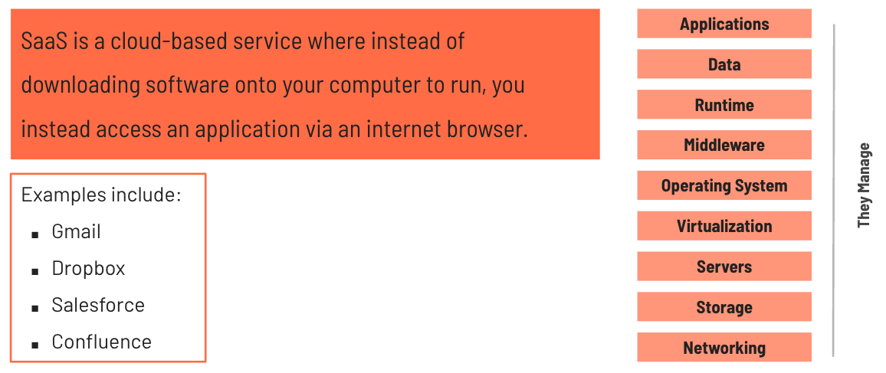
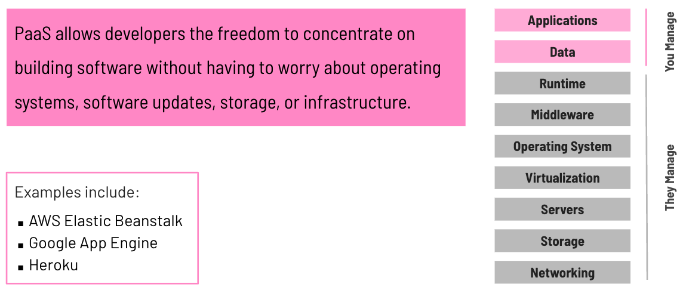
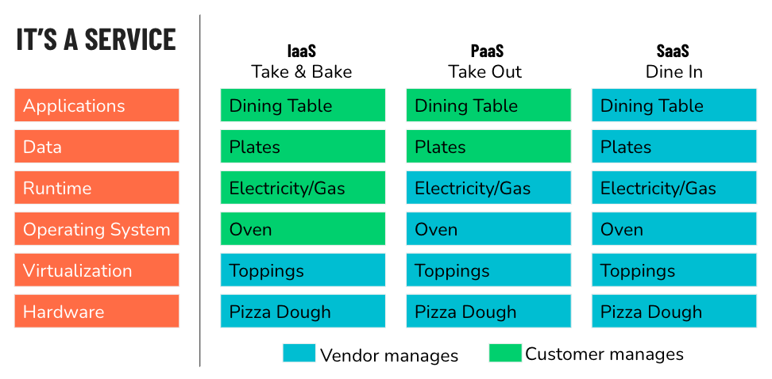

<h1>
  Intro to Cloud Infrastructure
  Everything is a Service
</h1>

**Learning objective:** By the end of this lesson, students will be able to explain the key differences between the three main cloud service models (IaaS, PaaS, and SaaS) and identify practical examples of each model.

To fully understand cloud computing, it's important to look at the different service models that make it possible. While cloud architecture provides the foundation and infrastructure for hosting and managing resources, the way you interact with and use those resources can vary.

This is where the three primary service models come in:

- **Infrastructure as a Service (IaaS)**
- **Software as a Service (SaaS)**
- **Platform as a Service (PaaS)**

Each of these models offers different levels of control, flexibility, and management, depending on your needs.

 

Let's take a look what each of these service models provides and how they shape cloud computing.

## Infrastructure as a Service

This cloud service model is called Infrastructure-as-a-Service (IaaS) and is the most basic category of cloud computing.

- You rent IT infrastructure (whether physical servers or virtual machines) from a cloud provider.

- This rented infrastructure acts just as a physical server in the sense that you can install applications, databases, or web servers.

- This is how an enterprise typically moves computing resources out of their data center into a cloud.

- Can be used to replace or augment existing infrastructure that is currently running on premises.

 

Some common examples of **IaaS** are:

- **Amazon Web Services (AWS)**
- **DigitalOcean**
- **Google Compute Engine**
- **Microsoft Azure**
- **Linode**

Each of these providers offers scalable virtual machines and other cloud infrastructure services.

## Software as a Service

SaaS provides software applications over the internet on a subscription or "pay-as-you-go" basis. This means you don't need to install or manage the software yourself—it's all handled by the service provider.

- No need to buy, install, or upgrade any hardware or software.

- New features and updates are automatically added by the provider.

- SaaS makes software that was once only available to large companies affordable and accessible to anyone.

 

Some common examples of **SaaS** are:

- **Google Apps**
- **Dropbox**
- **Salesforce**
- **Cisco WebEx**
- **GoToMeeting**

## Platform as a Service

This cloud service model is called Platform-as-a-Service (PaaS) and is gaining significant popularity.

- PaaS gives developers access to a development platform, such as a web server, that’s already up and running.
- Developers can quickly deploy their web applications with minimal effort and without worrying about server maintenance or infrastructure setup.
- PaaS operates a layer above IaaS, providing an environment to develop, run, and manage applications without handling lower-level tasks like load balancing or network configuration.
- The delivery model of PaaS is similar to SaaS, but instead of delivering software over the internet, it provides cloud components that assist with application development.
- PaaS allows developers to focus on building scalable, highly available applications without worrying about operating systems, software updates, storage, or other infrastructure concerns.

 

Some common examples of **PaaS** platforms include:

- **AWS Elastic Beanstalk**
- **Microsoft Azure**
- **Heroku**
- **Force.com**
- **Google App Engine**
- **Apache Stratos**
- **OpenShift**

## Cloud Service Models: The Pizza Analogy

Just like pizza, there are different ways to get your cloud services. These are called "service models." Let's break them down using the example of pizza.

 

 

| Service Model                      | Pizza Analogy                                                                                                         | Description                                                                                                               | Examples                                         |
| ---------------------------------- | --------------------------------------------------------------------------------------------------------------------- | ------------------------------------------------------------------------------------------------------------------------- | ------------------------------------------------ |
| On-Premise (No Cloud)              | Making pizza from scratch: You make the dough, add the toppings, cook it, and eat at home.                            | You manage everything—hardware, software, servers, and maintenance, all done in-house.                                    | N/A                                              |
| Infrastructure as a Service (IaaS) | Take-and-bake pizza: The restaurant prepares the pizza, but you take it home, cook it, and eat it.                    | The cloud provider supplies infrastructure (VMs or storage), but you handle setup, maintenance, and running applications. | AWS EC2, Google Compute Engine, Microsoft Azure  |
| Platform as a Service (PaaS)       | Pizza delivery: The restaurant makes and cooks the pizza, but you use your own plates and table.                      | The cloud provider handles infrastructure and platform, but you manage and run your applications.                         | AWS Elastic Beanstalk, Heroku, Google App Engine |
| Software as a Service (SaaS)       | Dining out: You go to the restaurant, sit at their table, eat their pizza, and don't worry about cooking or cleaning. | Fully managed applications are provided over the internet—no setup or maintenance required.                               | Google Apps, Dropbox, Salesforce, Zoom           |
