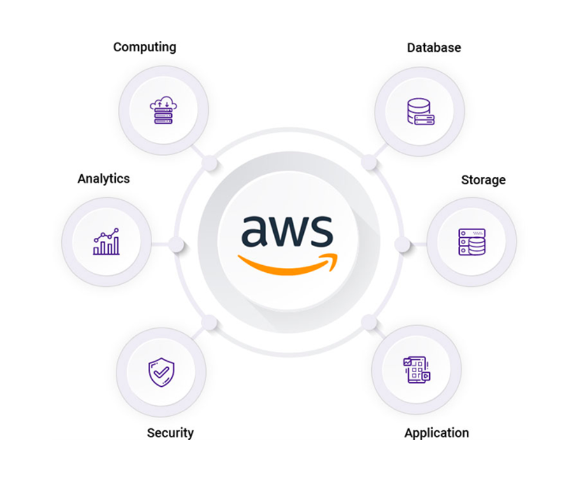
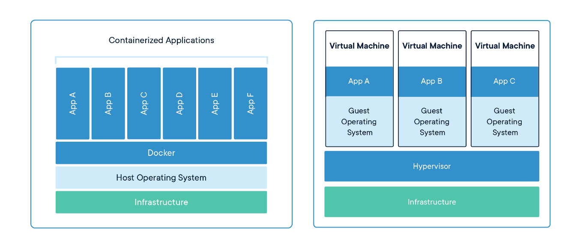

<h1>
  Intro to Cloud Infrastructure
  Virtualization and Containerization
</h1>

**Learning objective:** By the end of this lesson, students will be able to describe the roles of virtualization and containerization in cloud infrastructure.

## What is Cloud Infrastructure?

Cloud infrastructure includes the essential components for cloud computing. This consists of networking equipment, servers, and data storage. It also features a hardware abstraction layer that enables resource virtualization, helping to reduce costs through economies of scale. In simple terms, cloud infrastructure is the foundation needed to host services and applications in the cloud.

  <h2 class="title">Allow me to demonstrate...</h2>
  5 min

The [AWS Cloud Products page](https://aws.amazon.com/products/?aws-products-all.sort-by=item.additionalFields.productNameLowercase&aws-products-all.sort-order=asc&awsf.re%3AInvent=*all&awsf.Free%20Tier%20Type=*all&awsf.tech-category=*all) has a full listing of all AWS products and services (over 240!)

- If you want to run containers on AWS, what services might you use?

- What about a SQL database?

- Have you heard of any of these services? Do you currently use them?

## How Does Cloud Infrastructure Work?

The capabilities of cloud infrastructure are enabled by two key concepts:

- **Virtualization:** This technology lets you run several virtual machines (VMs) on one physical server, making better use of resources and improving efficiency.

- **Containerization:** This method wraps applications and everything they need into small, isolated packages called containers, allowing them to run reliably in different environments.

These technologies work together to make cloud services flexible, scalable, and cost-effective.

 

[Source](https://www.docker.com/what-container#/package_software)

## Virtualization

**Virtualization** divides physical computing resources, making cloud computing possible.

Using software called a **hypervisor**, virtualization splits the physical resources of a server (such as RAM, CPU, and storage) into virtual resources. For example, you may be using this technology right now to run a virtual machine on your laptop.

A physical server running a hypervisor is called a **host**.

**Virtual machines** (VMs), or **guests**, run on this host. The virtual machine operates like a real server, with access to virtual hardware, but it’s unaware that it's running on shared resources rather than a physical server.

## Containerization

How is containerization different from virtualization?

A **container** is a form of virtualization at the **operating system** level. The OS kernel creates isolated environments for running specific applications.

Instead of dividing physical resources, tools like Docker split **OS resources**—such as the process namespace, network, storage, and file system. Each container has its own processes and file system, making it much lighter and faster than a virtual machine.

  <h2 class="title">What is the biggest difference between virtualization and containerization?</h2>
  2 min

✅ Click to see our answer

 

 In a <strong>virtualized</strong> environment, each virtual machine has its own guest OS.

 In a <strong>containerized</strong> environment, the operating system lives on the physical server and the OS resources are split across each container.

